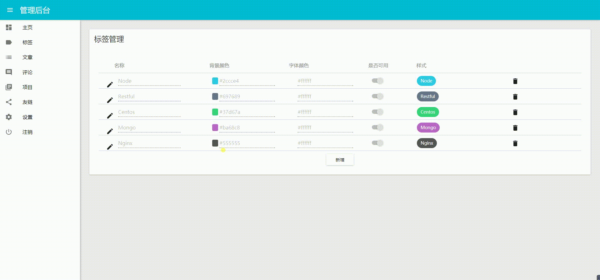
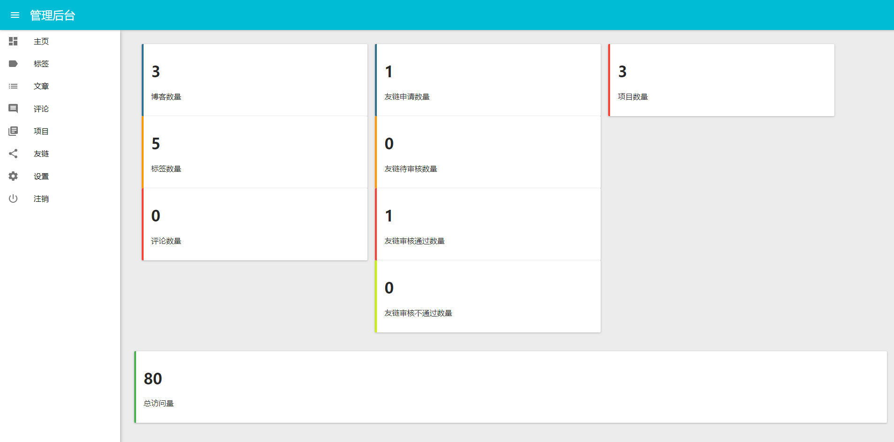
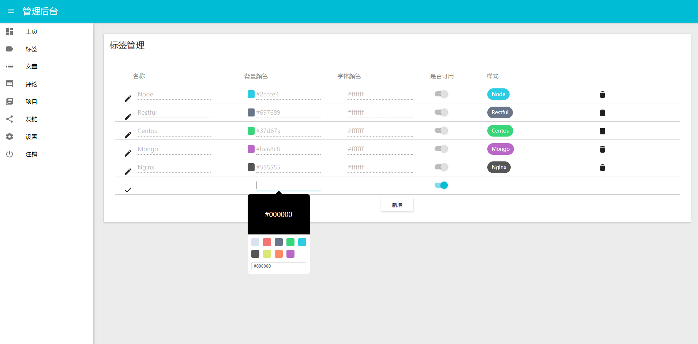
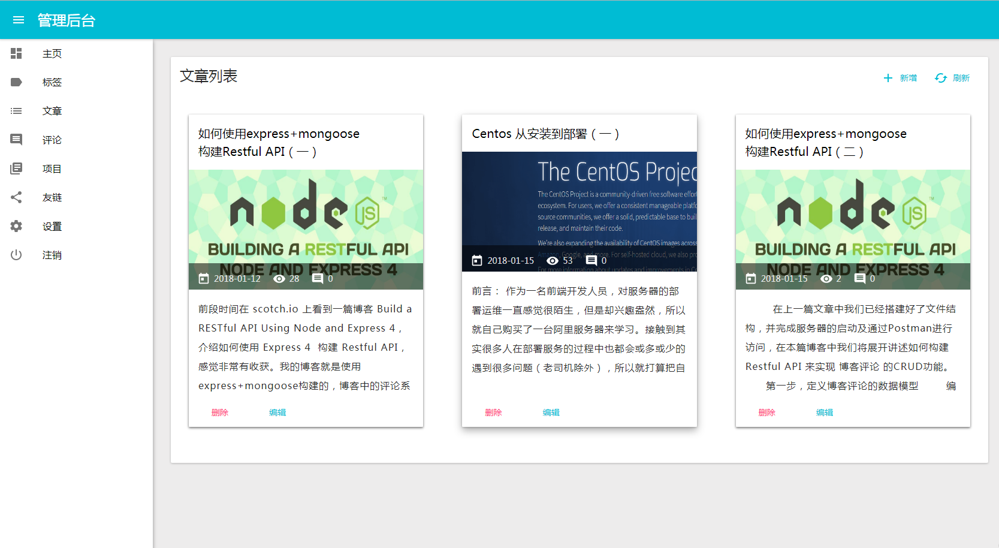
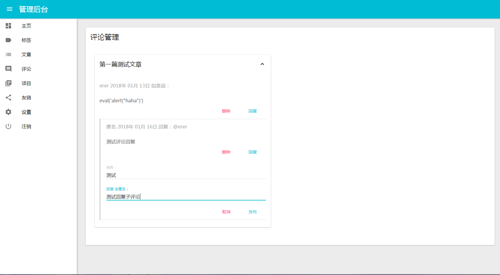
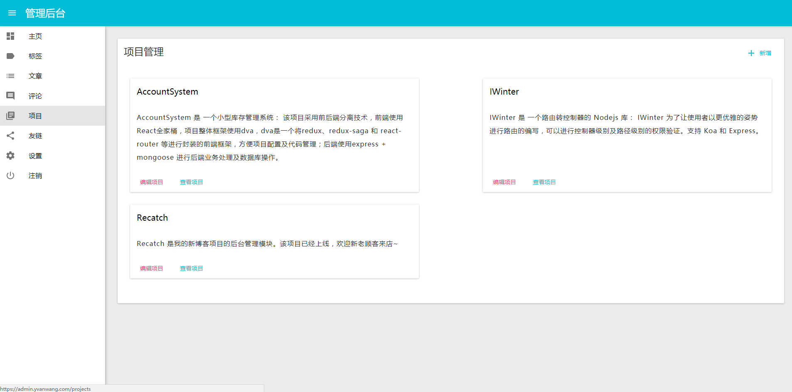
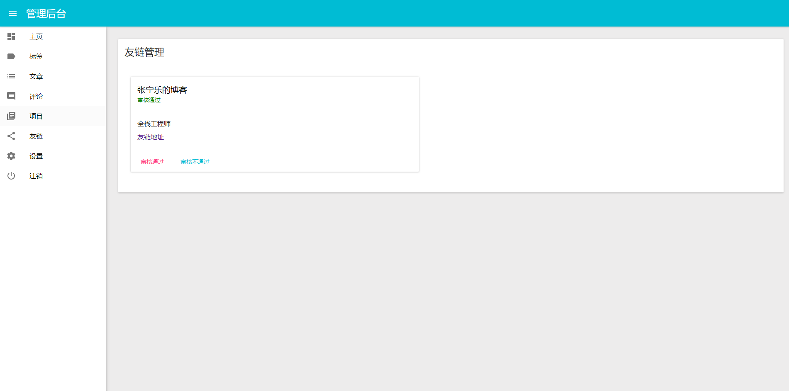

## 博客项目第二版管理后台 代号 recatch

该项目为我的个人博客第二版，实现功能：</br>
`1.`博客数据预览</br>
`2.`标签管理</br>
`3.`文章管理</br>
`4.`评论管理</br>
`5.`项目管理</br>
`6.`友链管理</br>
`7.`个人信息设置</br>
等7个模块功能。</br>



[在线预览地址](https://admin.yvanwang.com/)</br>
体验账号：registor</br>
密码：123456</br>
测试账号，请不要发布文章 :)
暂时没有开放注册功能。。。

### 项目技术栈
该项目采用前后端分离技术，前端依然采用 React 系列技术栈，包括： </br>
react/redux/redux-form/redux-orm/react-router v4/material-ui，使用 Typescript 进行代码编写。</br>

### 项目部分界面
`1.`博客首页</br>
实现一个简单的站点数据概览功能：</br>



`2.`标签管理</br>
该模块主要进行标签的增删操作：</br>



`3.`文章管理</br>
该模块主要进行文章的增加修改和删除操作：</br>



`4.`评论管理</br>
对文章的评论进行管理</br>



`5.`项目管理</br>
该模块主要用于编辑个人项目，用于前端界面展示</br>



`6.`友链管理</br>
博客首页支持访客增加友链申请，后端管理界面可以用于审核</br>



### 如何运行
`1.` `git clone https://github.com/yvanwangl/recatch.git`</br>
`2.` `cd recatch && npm install`</br>
`3.` `npm run start`</br>

### 项目构建
`1.` 通过 `npm run build` 进行项目构建</br>

### 项目部署
该项目支持两种部署方式：</br>
`1.` 基于node环境部署：`npm run start:prod`</br>
注意： 运行前需要对环境变量进行配置</br>
该方式的部署需要修改根目录下的 ecosystem.config.js 文件</br>

```
env_production: {
    "PROXY_HOST": "localhost",
    "PROXY_PORT": 8082,
    "PORT": 8084,
    "NODE_ENV": "production",
}
```

`2.`部署 docker 容器：</br>
首先构建 docker 镜像，需要在项目根目录下运行：`docker build --rm -f Dockerfile -t recatch:latest .`</br>
然后使用 docker-compose 运行容器：docker-compose up -d</br>
注意： 运行前需要对环境变量进行配置</br>
该方式的部署需要修改根目录下的 docker-compose.yml 文件</br>

```
environment:
    - PROXY_PORT=8082
    - PORT=8084
    - PROXY_HOST=192.168.0.1
```

### 配置参数说明：
PROXY_HOST: 代理服务器地址</br>
PROXY_PORT: 代理服务器端口</br>
PORT: 资源服务器端口</br>

部署模式下，该项目会起一个 node 资源服务器，将以 `/api` 为前缀的请求转发至代理服务器</br>


由于该项目采用前后端分离的方式进行开发，只部署该项目没有后端服务提供数据，所以还需要部署服务项目 [recatch-service](https://github.com/yvanwangl/recatch-service)

> 欢迎Star，有问题请提 issue :)
